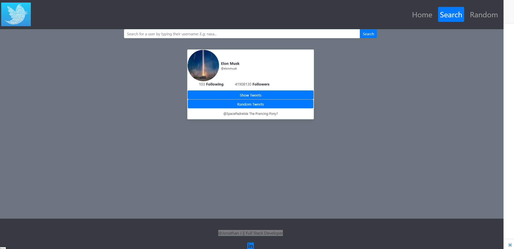
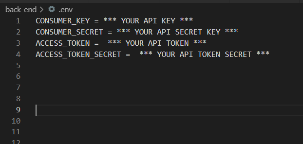

# Twitter-Showcase-App

-   This application searches the desire twitter user and showcase their tweet!
-   This project's Client side was built entirely in React.js, it's Server side was built using Python/Flask and [Twitter API](https://developer.twitter.com/en/products/twitter-api)

[Want to search your Twitter?](https://twitter-tweet-tag.herokuapp.com/search)

# Instructions

## Search

1. Navigate to Search
2. Type in the username of the desire Twitter's user. E.g: nasa or bmw

## In order for this repository to work properly, if ever clone or download, please follow these steps below

1. Under the project root directoy, create a `back-end` folder
2. Make sure you have Python downloaded on your computer:

-   Open your CMD (Command Prompt) or git bash(if downloaded already)
-   Navigate to `back-end` and download the require packages listing below using Python Package Manager `pip`
    -   [python-dotenv](https://pypi.org/project/python-dotenv/)
    -   [requests](https://requests.readthedocs.io/en/latest/user/install/#install)
    -   [Flask](https://flask.palletsprojects.com/en/1.1.x/installation/#install-flask)

3. Move `app.py` to `back-end` directory
    - under `app.py` line 6 change from `static_folder='./front-end/build/` to `static_folder='../front-end/build/`
4. Then under `back-end` directory create a file name `.env` **Dont't forget the dot (.)**
5. Before getting to the next step:
    - Make sure to have a [Developer-Twitter-account](https://developer.twitter.com/en/docs) if not already then create one in order to generate your API Keys needed for this project to function correctly
6. Navigate or open `.env` file and add _exactly_ what the screenshot below has

# Summary

My first full fledge Full Stack project, i could say i enjoyed and had fun while building it's client-side and server side. With challenges i never faced before such as creating a connection between React.js and internal API Flask then from internal API Flask to external API, in this case [Twitter API](https://developer.twitter.com/en/products/twitter-api). Thus, navigating Twiiter Api website, creating a developer account in order to have access or be authorized to use their API. Furthermore, testing their endpoints on Postman to simulate what i'm suppose to do in my server then handling those data appropriately to send back to React.js and therefore display it to the user. Moveover, as i was deploying app to Heroku, more errors to handle and a lot of configuring to guide Heroku on properly build and find the right static files to display to user. In conclusion, with every error i encountered, i learned a valuable a lesson, errors could be consider as a step closer to perfection.

# Author

**Jonathan Jimenez** - Full Stack Developer - [LinkedIn](https://www.linkedin.com/in/jonathan-jimenez101/) | [Website](https://www.jonathanjimenez.tech)
